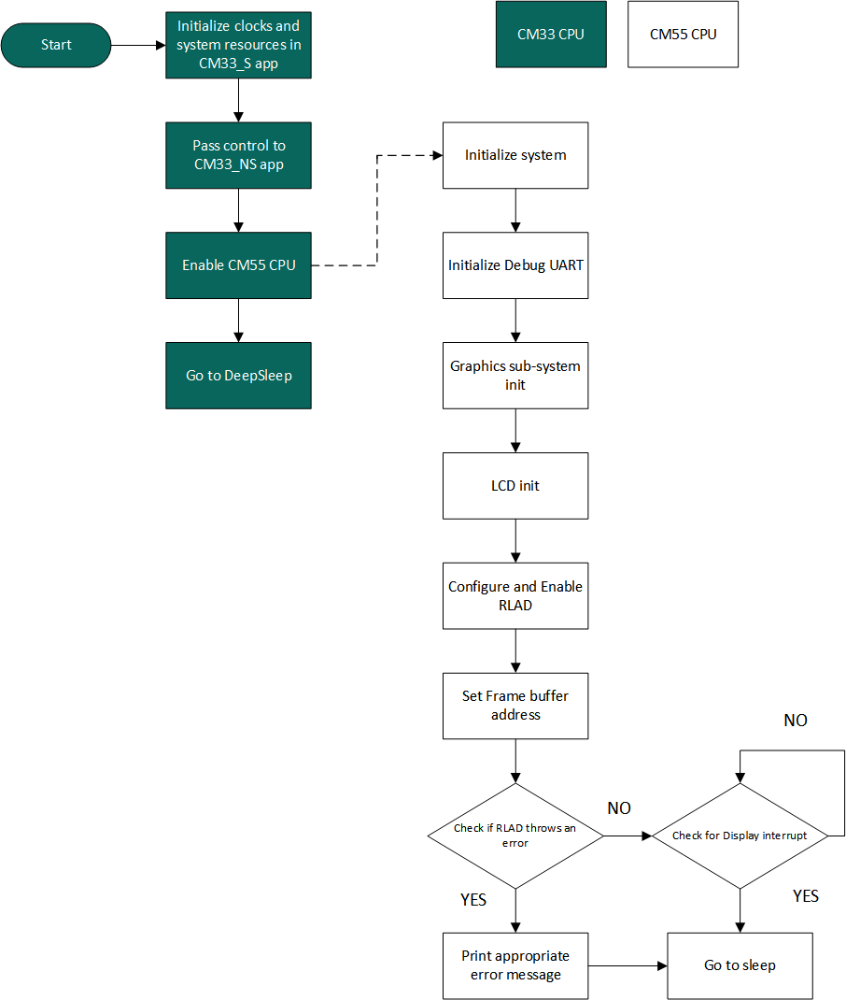
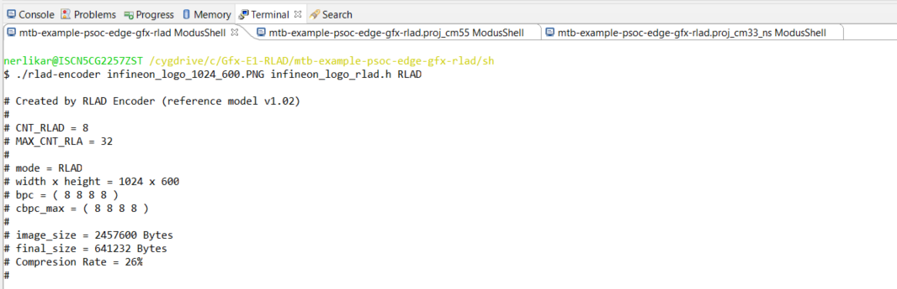

[Click here](../README.md) to view the README.

## Design and implementation

This project uses [4.3-inch Capacitive Touch IPS Display for Raspberry Pi, DSI Interface, 800x480 pixel](https://www.waveshare.com/4.3inch-dsi-lcd.htm) from Waveshare. The LCD houses a Chipone ICN6211 display controller and uses the MIPI DSI interface.

The design of this application is minimalistic to get started with code examples on PSOC&trade; Edge MCU devices. All PSOC&trade; Edge E84 MCU applications have a dual-CPU three-project structure to develop code for the CM33 and CM55 cores. The CM33 core has two separate projects for the secure processing environment (SPE) and non-secure processing environment (NSPE). A project folder consists of various subfolders, each denoting a specific aspect of the project. The three project folders are as follows:

**Table 1. Application projects**

Project | Description
--------|------------------------
*proj_cm33_s* | Project for CM33 secure processing environment (SPE)
*proj_cm33_ns* | Project for CM33 non-secure processing environment (NSPE)
*proj_cm55* | CM55 project

<br>

In this code example, at device reset, the secure boot process starts from the ROM boot with the secure enclave (SE) as the root of trust (RoT). From the secure enclave, the boot flow is passed on to the system CPU subsystem where the secure CM33 application starts. After all necessary secure configurations, the flow is passed on to the non-secure CM33 application. Resource initialization for this example is performed by this CM33 non-secure project. It configures the system clocks, pins, clock to peripheral connections, and other platform resources. It then enables the CM55 core using the `Cy_SysEnableCM55()` function and puts itself (CM33) into DeepSleep mode. The main firmware executes on the CM55 core.

The static image to be displayed on the 4.3-inch display is compressed using the [RLAD encoder](#compression-using-rlad-encoder). The compressed image is stored in the external flash memory during programming. The compressed image data is then copied to a buffer in *gpu_buf* region of system SRAM (SoCMEM) memory. The *cy_gpu_buf* (GPU buffer) region is configured as a non-cacheable region of the SoCMEM.

> **Note:** To place the data within various memory regions, use the *CY_SECTION("region-name")* utility function.

In the firmware routine executing on the CM55 CPU, the image is then decompressed by the RLAD decoder, which is part of the Display Controller (DC), and rendered through the MIPI DSI controller on the 4.3-inch LCD display. After displaying the uncompressed image, the CM55 CPU is put into sleep.

**Figure 1. Application flowchart**




### Compression using RLAD-encoder

The *utility/* folder contains the *rlad-encoder* script. Using modus-shell, navigate to this location and compress the source image from png format to a C header using the following command:

```
./rlad-encoder <source-image>.png <compresses-image>.h RLAD
```

**Figure 2. RLAD compression using rlad-encoder**



After encoding, it is recommended to add the *CY_SECTION(".cy_socmem_data")* header to the image variable definition. This will link the image in the system SRAM (SoCMEM) memory region during the linking process. For example:

```
CY_ALIGN(128) CY_SECTION(".cy_socmem_data") unsigned char img_ptr[641232]
```